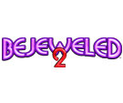
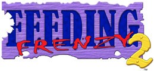
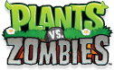

# Games
Below is a list of games I've worked on why at PopCap: -

|||
|---|---|
||**Platforms:** Windows, XBLA, Xbox 360 **Development Languages:** C++ **Localized into:** French, Italian, German, Spanish|
||**Platforms:** Windows, XBLA, Xbox 360 **Development Languages:** C++ **Localized into:** French, Italian, German, Spanish|
||**Platforms:** Windows, XBLA, Xbox 360 **Development Languages:** C++ **Localized into:** French, Italian, German, Spanish, Japanese, Simplified Chinese, Traditional Chinese|
||**Platforms:** Windows, XBLA, iOS **Development Languages:** C++, Objective-C **Localized into:** French, Italian, German, Spanish|
||**Platforms:** Windows, Mac OS X, XBLA **Development Languages:** C++ **Localized into:** French, Italian, German, Spanish|
||**Platforms:** Windows, XBLA **Development Languages:** C++ **Localized into:** French, Italian, German, Spanish|
||**Platforms:** Windows, XBLA **Development Languages:** C++ **Localized into:** French, Italian, German, Spanish|

----

**N.B.** All logos belong to their respective owners
